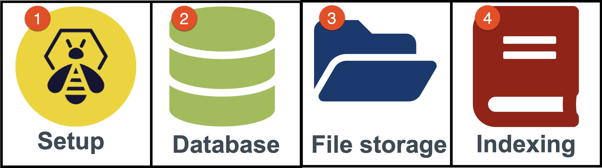

# Installation & configuration guides

## Overview

The scalability of TheHive allows it to be set up as a standalone server or as nodes inside cluster. Any number of nodes can rely on a database and a file system also setup as standalone servers or a cluster. Before starting installing and configuring, you need to identify and define the targetted architecture.

### Choose a setup

The modular architecture makes it support several types of database, file storage system and indexing system. The initial choices made with the target architecture and the setup are crucial, especially for the database. 
If high availability and fault tolerance are necessary, implementing a cluster might be the choice, and this choice determines the database, the file storage and indexing system to install.  

### Choose a database 

Once the target setup is identified, the first choice to make is the database. Even of local Berkeley DB and Cassandra database are supported, we recommend using [Apache Cassandra](https://cassandra.apache.org/), which is a scalable and high available Database, even for standalone servers. Berkeley DB can be enough for testing purposes.

!!! Danger "Upgradability"
    This choice is decisive as migration from Berkeley DB to Cassandra **is not possible**.
     

### Choose a file storage system

Like for databases, several options exist regarding file system. 
Basically, for standalone setups, using the local filesystem is the easiest solution. If installing a cluster, there are several options:

- Using a share NFS folder
- Using [Apache Hadoop](https://hadoop.apache.org/), a distributed file system
- Using a S3-compatible storage service ; for example with [Min.IO](https://min.io/)

!!! Tip "Upgradability"
    Starting with a standalone server and a local file storage and upgrading to a cluster with S3 of Hadoop is possible. Existing files can be moved to the targetted solutions.

### Choose an index system 

Introduced with TheHive 4.1 to increase performances, TheHive relies on a dedicated indexing process. With a standalone setup, using a local index with Lucene is sufficient.

In the case of a cluster, all nodes have to connect to the same index: an instance of **Elasticsearch** is then required.   

!!! Tip "Upgradability"
    Starting with a standalone server and Lucene and upgrading to a cluster with Elasticsearch is possible. Indices can be rebuilt. However, it can takes some time.

## Installation Guides

- Install and configure TheHive 4 on a [Debian](Installation/Install_deb.md) like operating system;
- Install and configure TheHive 4 on a [Redhat](Installation/Install_rpm.md) like operating system;
- Install and configure TheHive 4 from [binaries](Installation/Install_binaries.md) packages;

If you want to build TheHive from sources, you can follow [this guide](Installation/Build_sources.md).

## Configuration Guides

## Uses Cases

### Basic stand alone server

Follow installation guides for you prefered operating system.

### 3 nodes cluster

Installing a cluster with 3 nodes: 
  
  - 3 TheHive servers  
  - 3 Cassandra servers 
  - 3 Min.IO servers

Go to [this page](Architecture/3_nodes_cluster.md) for a fully detailled installation and configuration guide. 