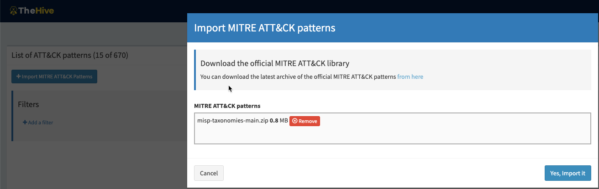

# Tactics, Techniques & Procedures

!!! Warning "TheHive 4.1.0+ is required to use TTPs"

Starting with version 4.1.0, TheHive allows to bind _Cases_ to _TTPs (Tactics, Techniques & Procedures)_. The [MITRE ATT&CK framework](https://attack.mitre.org/) has been chosen to define these TTPs.

## Import MITRE ATT&CK patterns
To access and import MITRE ATT&CK patterns definition, beeing `admin` or at least have the role `managePattern` is required.

1. In the admin organisation, open the `ATT&CK Patterns` menu

    {: witdh=600}

2. Click on `Import MITRE ATT&CK Patterns` and select the appropriate file

    {: witdh=600}

3. Ensure patterns are imported 

    {: witdh=600}

!!! Tip
    A direct link to the current zip archive of [MITRE ATT&CK patterns](https://raw.githubusercontent.com/mitre/cti/master/enterprise-attack/enterprise-attack.json) let you download it quickly from the official github page.

## Use MITRE ATT&CK

Refer to [this page](../cases/ttps.md) to learn how to add TTPs (_Tactics, Techniques and Procedures_) to a Case.
