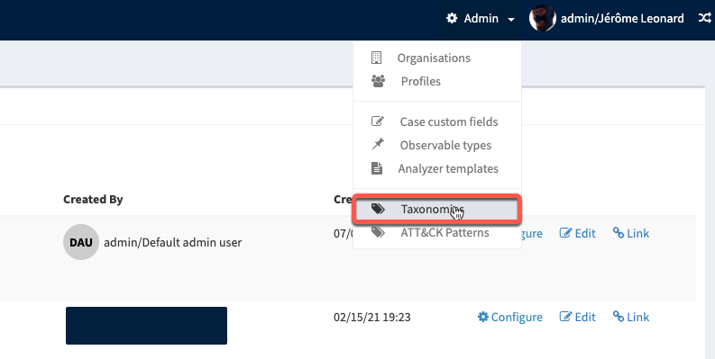
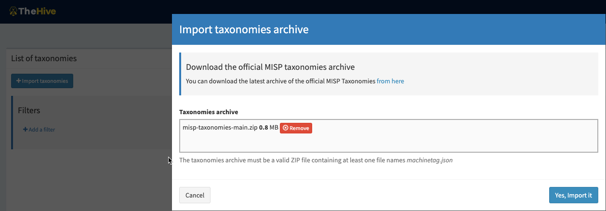

# Taxonomies and Tags

!!! Warning "TheHive 4.1.0+ is required to use Taxnomies"

TheHive 4.1.0 introduces the support of Taxonomies as it is defined and published by [MISP](https://github.com/MISP/misp-taxonomies). These set of classification libraries can be used in THeHive to tag `Cases`, `Observables` and `Alerts`. 

!!! Tip
    Not only [MISP-Taxonomies](https://github.com/MISP/misp-taxonomies) are supported by TheHive, but you can also build your own by:
    
    - Following the IETF draft [https://tools.ietf.org/id/draft-dulaunoy-misp-taxonomy-format-07.html](https://tools.ietf.org/id/draft-dulaunoy-misp-taxonomy-format-07.html)
    - Draw inspiration from an existing definition file :-)

By default, TheHive does not contain any taxonomy. 

## Import taxonomies

To access and import taxonomies, beeing `admin` or at least have the role `manageTaxonomy` is required.

1. In the admin organisation, open the `Taxonomies` menu

    {: witdh=600}

2. Click on `Import taxonomies` and select the file containing the libraries
 
    {: witdh=600}

!!! Tip
    A direct link to the current zip archive of [MISP-Taxonomies](https://github.com/MISP/misp-taxonomies) let you download it quickly.

## Enable interesting taxonomies

Select the libraries you would like your user be able to use in `Case` or `Observables`, and **enable it**.

<video height="450" autoplay controls muted>
    <source src="/thehive/user-guides/administration/images/admin-taxonomy-details.mp4" type="video/mp4">
Your browser does not support the video tag.
</video>

!!! Warning
    Enabling a taxonomy means all users of all Organisations can use one or more included tags in a `Case` or `Observable`.

## Tags from taxonomies versus free text tags 

In the UI, users can add free text tags, and also choose to add a tag from a library in a dedicated view. 

Free text tags are managed at the Organisation level by users with `orgadmin` profile, or at least `manageTag` permission.

Refer to appropriate pages to learn about [how to manage custom tags](../organisation/custom-tags.md), and [how to use tags](../cases/create-case.md) in TheHive.

!!! Info
    If a tag is imported with an `Alert` or created with the API, TheHive tries to _dissect_ it as a _machinetag_. It tries to identify a namespace, a predicate and an optional value. 
    
    If successful, and if an associated taxonomy exists **and is enabled**, the tag is linked to the library ; if not, it is considered as a free text tag.