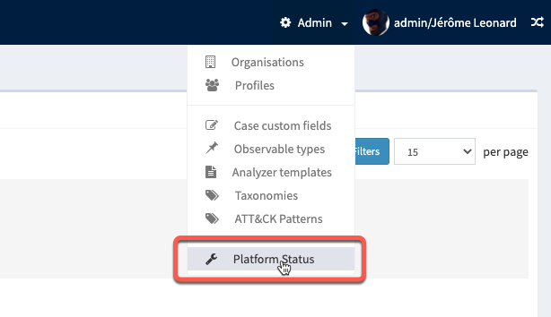
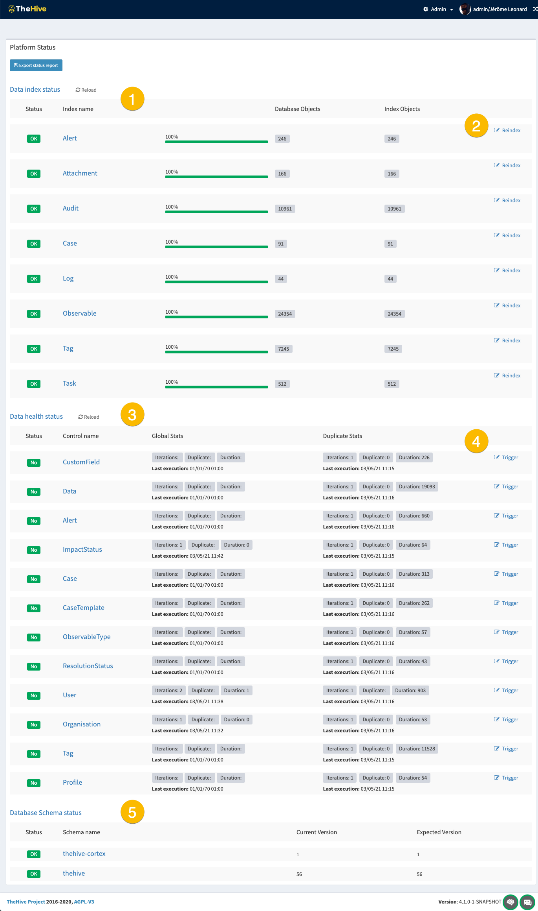

# Plateform status

With the database update and the new indexing engine, a **health status page** has been introduced. 

This page not only displays health status for indexes, but also for global data in the database. Indeed, when an element is created, no duplicate should exist, a control is then processed. 

This is sumarised in the **Data health status** part.

Accessing to this page requires to be `admin` of the plateform, or at least, have `managePlateform` permission.

## Health status page
This plage can be accessed in the `Admin` organisation view. Open the `Admin` menu and click on `Plateform status`

!!! Note
    When opening the page, the indexes status can take a while.

with: 

1. List of indexes and their health status. _Database objects_ number and _Index objects_ number should be equal for a good health status
2. When the status is `Error`, proceed to reindex
3. List of data types health status in the database and their duplicate state
4. Process for a duplicate check on a specific data type if status is {==XXX warning XXX==}
    

Quand un élément est créé et qu'il ne doit pas y avoir de doublon (caseNumber, alert type+source+sourceRef, customField, ...), un contrôle est réalisé (duplicationCheck).
Le résultat de ces contrôles sont dans la clé duplicateStats avec les champs :
  - last pour le résultat du dernier check (avec le nombre de doublon et la durée du check en milliseconds),
  - lastDate pour la date du dernier check
  - global est l'aggrégation de tous les checks depuis le lancement de TH (avec le nombre d'iterations)

Les checks sont déclenchés de façon à limiter le nombre d'iterations quand on fait plusieurs ajouts dans un courte période. needCheck indique qu'un check est en attente et duplicateTimer que je check est programmé.

En plus des contrôles de doublon, il y a une multitude d'autres contrôles (un share doit être attaché à une seule orga et un seule case, une alerte ne peut être importé qu'une fois, ...). Ces checks sont réalisés toutes les 6 heures par défaut. On retrouve le résultat de ces checks dans globalStats avec la même logique last, lastDate et global. Par contre, les clés ne sont pas duplicate mais un ensemble de valeurs propres à chaque type de contrôle (orphan, extraOrganisation, nonExistentOrganisation, missingOrganisation, ...). Chaque valeur me permettent d'identifier la situation recontrée.