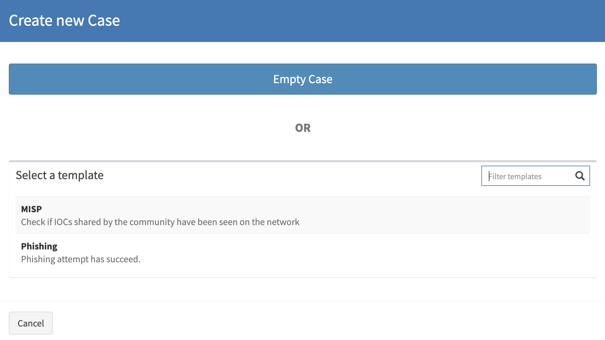
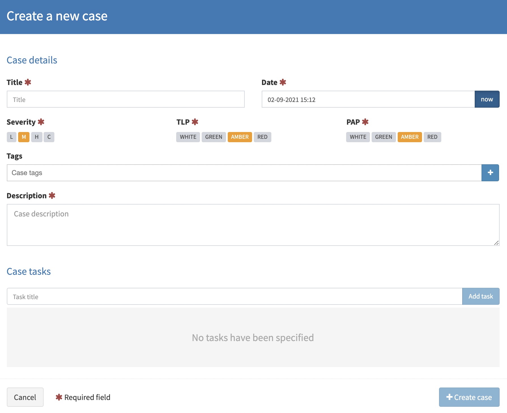

# Create a case

Creating a `case` is one of the basic TheHive functionnalities.

To create a `case`, you must have the `manageCase` permission (refer to [Profiles and permissions](../../Administrators/profiles/))

In TheHive banner, clic the button *New case*:

Then you can either chose to use a `Case template`, or start it from scratch using *Empty case* (this option may be unavailable following your `organisation` configuration):

Once you chose your template, fill the `case` details:

- Title *
- Date (`startDate`) *
- Severity *
- TLP/PAP *
- Tags
- Description *
- Case tasks

Information annoted with a '*' are mandatory information. 

Once `case` details filled, finally clic on *Create case* button.