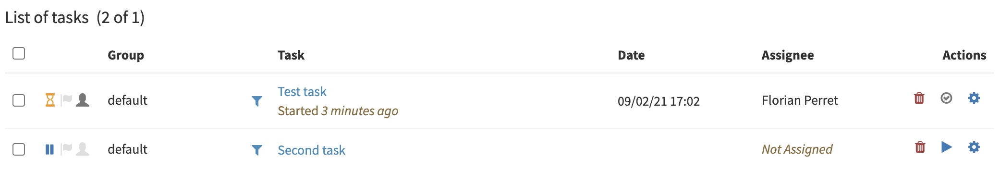
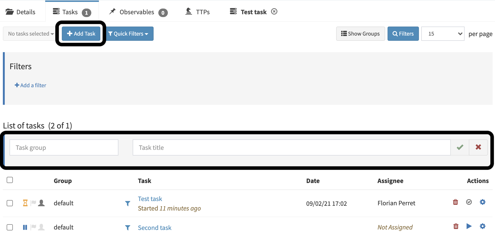

# Manage tasks

In a TheHive `case`, you can find the tab `tasks`.

## Tasks List

You can consult `cases` *Task list* (*Case > Tasks*). you must have the `manageCase` permission (refer to [Profiles and permissions](../../administrators/profiles))

The list contains the following information:

- Group: The `task` *group* membership
- Task: The `task` *title*
- Date: the *startDate* of the `task`
- Assignee: The `user` assigned to the `task`
- Actions: Delete, start/close or trigger a `responder` on the `task`

## Create a task

You can create a `task` in a `case`. you must have the `manageCase` permission (refer to [Profiles and permissions](../../administrators/profiles))

Open your *Task list* and clic *Create task* button. On the top of the *Task list* a ribbon will appear, inviting you to fill the *Task group* and the *Task title*

## Task information

Open your `task` to retrieve it's information (*Case > Tasks > Task*)

### Task Actions

Open your `task` to find the possible actions (*Case > Tasks > Task*)

Task actions buttons are on the top-right of a *Task page*:

You can trigger the following actions on a `task`:

- Sharing: Ability to share with *Linked organisations* the `task`
- Require Action: Declare that an action is required on this `task`
- Flag: Put a flag on the `task`
- Close: Close the `task`
- Responders: Trigger a responder on the `task`

### Basic information

Open your `task` to retrieve these information (*Case > Tasks > Task*)

A `task` *Basic information* contains the following elements:

- Title of the `task` *
- Group of `tasks` *
- Assignee of the `task` *
- startDate of the `task` *
- Duration of the `task`
- Status of the `task`

All information annoted with a '*' can be modified by clicking the pen when hovering the information.

### Task description

Open your `task` to retrieve this information (*Case > Tasks > Task*)

Under the *Basic information*, you can find the description field. It's a free text field, markdown formatted. 

### Task logs

Open your `task` to retrieve the task logs (*Case > Tasks > Task*)

The *Add new task log* allows you to create a *Task log*. 

*Task logs* are markdown formatted text. You can also attach a file to the log.

*Task logs* possible actions are:

- Create a task log
- Modify a task log
- Delete a task log
- Trigger a responder on the task log

