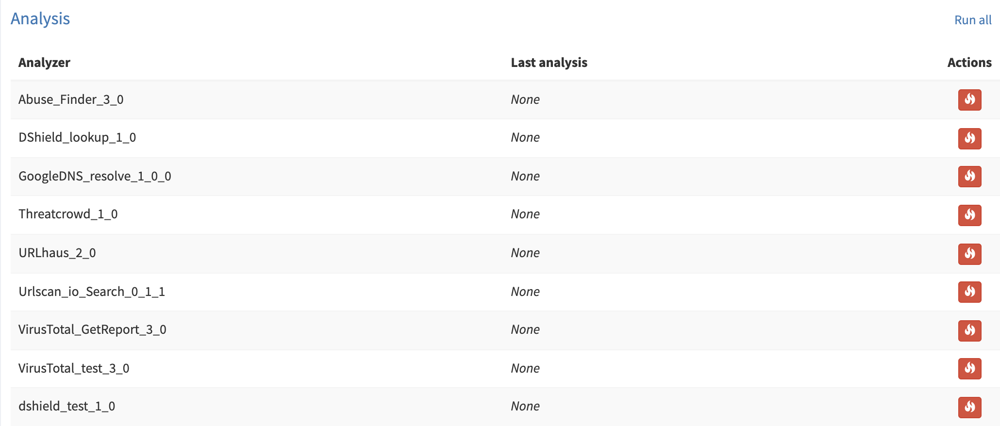
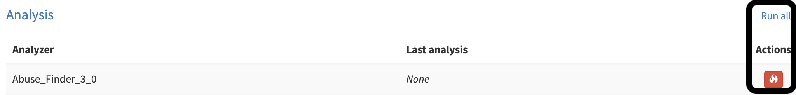
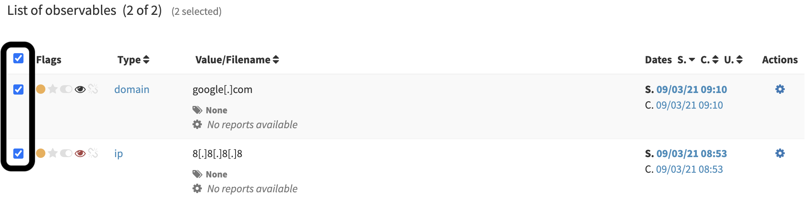
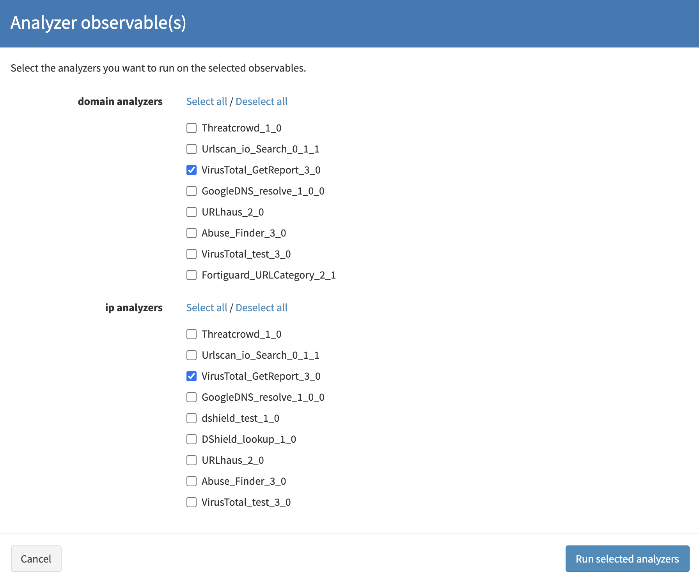
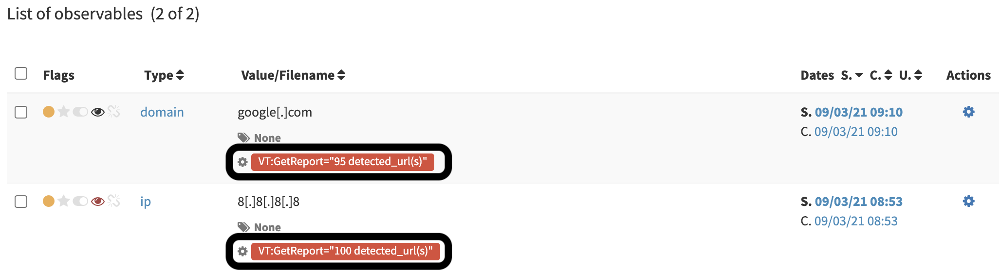
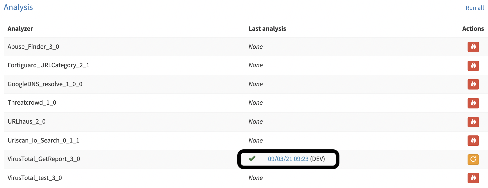

# Run Analyzers

In TheHive4 you can run `analyzers` on `observables`.

To run an `analyzer`, you must have the `manageAnalyse` permission (refer to [Profiles and permissions](../../Administrators/profiles/))

## From an observable page

You can trigger an `analyzer` on a single `observable` from it's page (*Case > Observables > Observable*).

In the *Analysis* section, you'll find every `analyzers` available for your `organisation` and compatible with the `observable` `dataType`:

On the right side of the *Analysis* section, you can trigger the `analyzers` of your choice by clicking on the fire button, or run them all via the button *Run all*:

## From the observables list

You can also trigger one or more `analyzers` on one or more `observables` from the *Observables list* (*Case > Observables*)

On the left side of the *Observables list*, you have checkboxes to select which `observables` to act on. You can even select all of them using the checkbox that is at the very top of the *Observables list*: 

Once selected, clic on the *Selected observables* menu, and chose *Run analyzers*:

Finally select the desired `analyzers` to trigger and clic *Run selected analyzers*:

## Consult analyzers report

Once the `analyzer` has been triggered and the job terminated, you can consult the *Job report* directly within TheHive.

### Short report

In the *Observables list* (*Case > Observables*), you have access to a `short report`:

### Long report

On the *Observable page* (*Case > Observables > Observable*), in the *Analysis* table, you can consult a HTML formatted `long report` by clicking on the analysis link:

