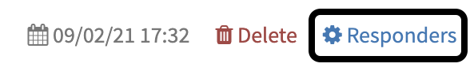
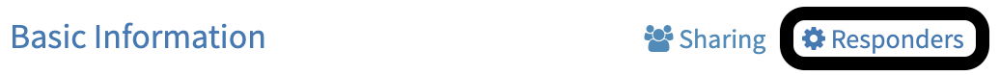

# Run Responders

In TheHive4, you can run `responders` on 4 type of objects:

- A `case`
- A `task`
- A `task log`
- An `observable`

To run a `responder`, you must have the `manageAction` permission (refer to [Profiles and permissions](../../Administrators/profiles/))

A `report` will be generated and provided to you.

## From a case

You can trigger a `responder` from a `case`.

On the `case` *Action ribbon*, trigger the *Responders* button

## From a task 

You can trigger a `responder` from a `task` (*Case > Tasks > Task*)

On the `task` *Action ribbon*, trigger the *Responders* button.

## From a task log

You can trigger a `responder` from a `task log` (*Case > Tasks > Task > Task log*)

On the `task log` *Action ribbon*, trigger the *Responders* button.

## From an observable

You can trigger a `responder` from an `observable` (*Case > Observables > Observable*)

On the `observable` *Action ribbon*, trigger the *Responders* button.

## View responder report

`responders` provides you a report that can have two status:

- Success
- Failure

The report is visible in the object where you triggered it (`case`, `observable`, `task` or `task log`)

In addition of the status, a text report is provided allowing you to know what happens:

