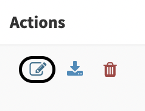
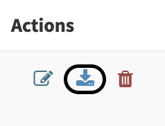
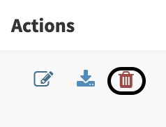

# Case Templates 

Some cases may share the same structure (`customfields`, `tags`, `tasks`, `description`, ...). Templates are here to automatically add tasks, description, metrics and custom fields while creating a new case. A user can choose to create an empty case or based on a registered template.

## List case templates

The management of the case templates is accessible through the menu *Organisation > Case Templates* . To manage them your profile need to have the permission 'manageCaseTemplate' (refer to [Profiles and permissions](../Administrators/profiles.md)).

## Create or upload template

### Create a case template

In the case templates management page, clic the `New template` button (*Organisation > Case Templates > New Template*). 

In the case template you can set:

- Title prefix
- Severity
- TLP/PAP
- Tags
- Description
- Tasks
- Customfields 

Two fields are mandatory: 

- Template name (should be unique)
- Description

### Import a case template

You can also import your case template using a file in JSON format by clicking on the `Import template` button (*Organisation > Case templates > Import template*)

## Edit a case template

To edit a case template, open the case template list and clic the edit button on the actions column (*Organisation > Case Templates > Edit*).

## Export a case template

To export a case template, open the case template list and clic the export button on the actions column (*Organisation > Case Templates > Export*).

## Delete a case template

To delete a case template, open the case template list and clic the export button on the actions column (*Organisation > Case Templates > Export*).

