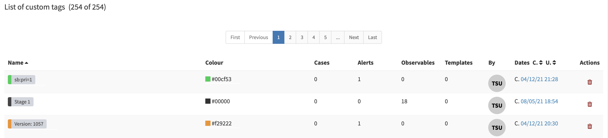

# Custom Tags

`custom tags` are `tags` manually created (out of libraries). 
You can find the list of your `custom tags` in *Organization > Custom tags*.

## List custom tags

The list contains the following information, for each `tag`:

- Number of `cases` tagged
- Number of `alerts` tagged
- Number of `observables` tagged
- Number of `case templates` containing the tag

## Modify a custom-tag border colour

You can modify your custom tags border colours. 

In the `custom tags` list (*Organization > Custom tags*), in the *Colour* column, clic on the square or colour code value to modify it. This will apply to all `cases`, `alerts` and `observables` that contains the `tag`.

## Delete a custom tag

You can also delete a custom tag. 

In the `custom tags` list (*Organization > Custom tags*), in the *Actions* column, clic on the delete button

---

⚠️ **Note**

Deleting a `custom tag` will delete the `tag` on each object containing it.

---