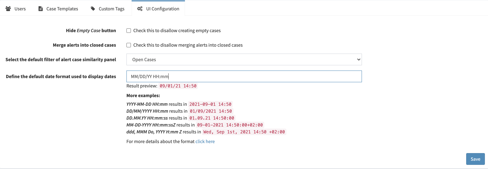

# UI configuration

You can change some user interface settings in the page UI Configuration (*Organisation > UI Configuration*)

You must have the permission `manageConfig` on your profile to manage UI Configuration. (refer to [Profiles and permissions](../../Administrators/profiles/))

## Hide Empty Case button

Check this checkbox to prevent your analyst to create a `case` without using a `case template`.

## Merge alerts into closed cases

Check this checkbox to disallow merging `alerts` into closed `cases`

## Select the default filter of alert case similarity panel

In this dropdown list, you can chose from various filter the default one used in `alerts` or `cases` similarity panel

## Define the default date format used to display dates

Define the time format used in your `organisation`.