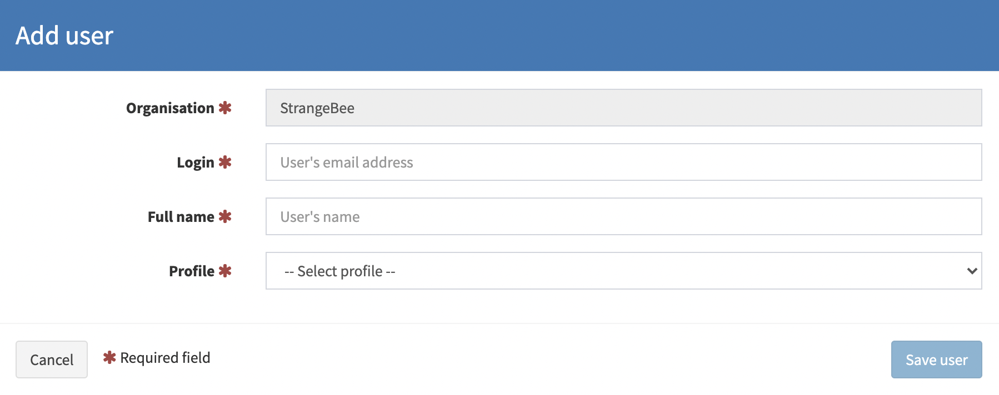
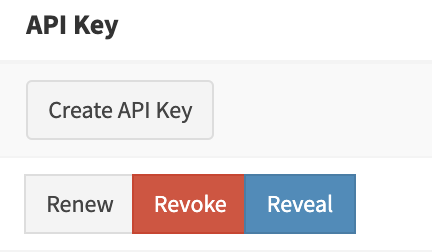

# Users management

In TheHive4 you can manage `users` that belongs to your `organisation` in the Users page (*Organisation > Users*)

You must have the permission `manageUser` on your profile to manage `users` of your `organisation`. (refer to [Profiles and permissions](../Administrators/profiles.md))

## Create new user

You can create a new `user` in your `organisation`. clic the *Create new user* button in the Users page (*Organisation > Users*)

You must provide the following information (they are all mandatory):

- Organisation (autmatically filled, non modifiable)
- Login (This will be used by the `user` to authenticate)
- Full Name (This will be used as display name)
- Profile (drop-down list to set a profile, that will define `user` `permissions`)

## List users

You can list the `users` that belongs to your `organisation` in the Users page (*Organisation > Users*)

In this list you can find the following information:

- Status
- Login
- Full Name
- Profile
- API Key
- MFA activation 
- Creation and last update dates

### Set or modify a user password

To set or modify a `user` password, clic the button *New password* (if the user never had a password) or *Edit password* in the column *Password* of the User list (*Organisation > Users*)

### Create, renew, revoke or reveal an user API Key

In the column *API Key* of the `user` list (*Organisation > Users*), you can:

- Create an *API Key* if the `user` never had one before
- Renew the `user` *API Key*
- Revoke the `user` *API Key*
- Reveal the `user`*API Key* in your user interface.

### Edit user information

You can edit the following user information from the user list (*Organisation > Users*):

- Full name
- Profile

To edit an `user` information, clic the *Edit user* button on the *Actions* column:

### Lock an user

Locking an `user` make the account unusable for any action. You can lock an `user` from the User list (*Organisation > Users*).

To lock an `user`, clic on the lock button:

### Delete an user

You can delete an `user` from your organisation via the User list (*Organisation > Users*)

---

⚠️ **Note**

Deleting an `user` is irrevocable. Recreating an `user` with the same information will not reattribute the `cases` the previous account was assigned to.

---

To delete an user, clic on the trash icon:

